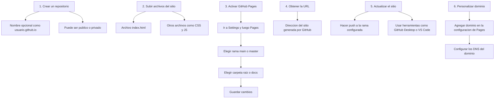

Este es un repositorio para mis desarrollos de P5 y javascripts

simpleConBinaryVerde
https://bruveping.github.io/DesarrollosP5/simpleConBinaryVerde/

pagina Clima Buenos Aires
https://bruveping.github.io/DesarrollosP5/paginaWebClimaB/

pagina Clima Asunción
https://bruveping.github.io/DesarrollosP5/paginaWebClimaD/
funciona con chrome y mozilla

Programa Simple de P5 para probar sliders y botones
https://bruveping.github.io/DesarrollosP5/esliderYbotones/

un Temporizador
https://bruveping.github.io/DesarrollosP5/cronometro0/

otro Temporizador https://bruveping.github.io/DesarrollosP5/cronometro01/

Random de palabras simple https://bruveping.github.io/DesarrollosP5/randomizaPalabraP5/

Experimentar con la teoría del color HSB https://bruveping.github.io/DesarrollosP5/colorHSVenP5/

Random de numeros, pensado para musica aleatoria https://bruveping.github.io/DesarrollosP5/paginaWebRandomNum/

Un monocromo de arte https://bruveping.github.io/DesarrollosP5/paginaNegra/

Otro monocromo de arte https://bruveping.github.io/DesarrollosP5/autoMonocromo/

mueve texto en red https://bruveping.github.io/DesarrollosP5/mueveElTextoREd_2024_10_16/

mueve texto en red 2 https://bruveping.github.io/DesarrollosP5/mueveElTextojs2024/

redacta informe académico https://bruveping.github.io/DesarrollosP5/redactarInformeAcade/

redacta informe académico https://bruveping.github.io/DesarrollosP5/contarPalabras/

Pequeño manual de CSS https://bruveping.github.io/DesarrollosP5/cssDisplay

Pequeño manual de CSS https://bruveping.github.io/DesarrollosP5/cssEjercicioLayout20241225

Pequeño manual de CSS https://bruveping.github.io/DesarrollosP5/cssAlinearElementos

Pequeño manual de CSS https://bruveping.github.io/DesarrollosP5/gridLayout

Pequeño manual de CSS https://bruveping.github.io/DesarrollosP5/cssEjercicioGridLayout2024_12_30

Mapa Mental Mermaid https://bruveping.github.io/DesarrollosP5/MapaMermaidEditorSlider001

Mapa Mental Mermaid a SVG https://bruveping.github.io/DesarrollosP5/MapaMermaidSVG0002

